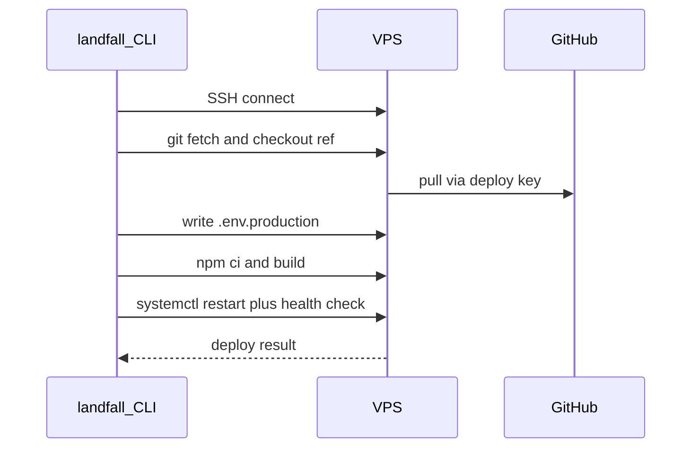

# Landfall

**Make landfall on your own VPS.** Open-source CLI for Git deploys with managed-platform convenience — secrets, Postgres, Redis, HTTPS, backups — without big-cloud lock-in.

MIT licensed. Contributions welcome — see [CONTRIBUTING.md](CONTRIBUTING.md).

```bash
cd /path/to/your-webapp
landfall deploy --env prod
```

Formerly known as `vpsdeploy`. Existing `vpsdeploy.toml` and `~/.config/vpsdeploy/` still work.

## Why this exists

Managed hosts are great until bills, lock-in, or limits get in the way. **Landfall** is for tech-savvy developers who want:

- Push-to-deploy style workflows you control
- Secrets that never live in git
- Optional Postgres / Redis / Caddy on the same (or separate) VPS
- Backups and a clear path to scale out later

You run the CLI from your laptop (or ask your AI agent to run it). The VPS builds and runs the app under systemd.

## Table of contents

- [Install](#install)
- [Use manually](#use-manually)
- [Use with your AI agent](#use-with-your-ai-agent)
- [Day-to-day commands](#day-to-day-commands)
- [Commands reference](#commands-reference)
- [Managing secrets](#managing-secrets)
- [PostgreSQL](#postgresql-on-the-vps)
- [Redis](#redis-on-the-vps)
- [Database backups & scale](#database-backups--scale)
- [Security hardening](#vps-security-hardening)
- [Setup validation](#setup-validation-landfall-check)
- [Configuration](#configuration)
- [How it works](#how-it-works)
- [Troubleshooting](#troubleshooting)
- [Contributing](#contributing)
- [Security & license](#security--license)

---

## Install

Requires Go (see `go.mod`) and SSH access to an Ubuntu 22.04/24.04 VPS.

```bash
git clone https://github.com/flaggx/vpsdeploymentautomation.git
cd vpsdeploymentautomation
make install    # builds and copies to ~/bin/landfall
```

Or:

```bash
go build -o ~/bin/landfall ./cmd/landfall/
```

Ensure `~/bin` is on your `PATH`, then:

```bash
landfall --help
```

**Makefile:** `make build` · `make install` · `make test` · `make vet` · `make fmt` · `make check` · `make clean`

---

## Use manually

### Prerequisites

- Ubuntu VPS with root SSH (first-time user setup)
- App repo on GitHub (Next.js works best with `output: 'standalone'`)
- Health endpoint that returns JSON with `"ok": true` — see [templates/health-route.ts.example](templates/health-route.ts.example)
- Domain pointed at the VPS if you want HTTPS via Caddy

### One-time setup

Run these from your **webapp** repo (not this tooling repo). Real `landfall.toml` belongs with the app.

```bash
# 1. Install the CLI (once on your laptop)
cd /path/to/vpsdeploymentautomation && make install

# 2. Create config + secrets store
cd /path/to/your-webapp
landfall init
landfall secrets init
# Commit landfall.toml to the app repo. Never commit secrets.
```

On the VPS as **root**, create a deploy user:

```bash
adduser deploy
usermod -aG sudo deploy
echo "deploy ALL=(ALL) NOPASSWD:ALL" > /etc/sudoers.d/deploy
chmod 440 /etc/sudoers.d/deploy
```

From your laptop:

```bash
ssh-copy-id -i ~/.ssh/id_ed25519 deploy@YOUR_VPS_IP
ssh deploy@YOUR_VPS_IP "echo connected"
```

Then, from the webapp repo:

```bash
landfall security harden --env prod
landfall bootstrap --env prod          # add printed deploy key to GitHub → Deploy keys
# optional:
landfall db bootstrap --env prod --save-secret
landfall redis bootstrap --env prod --save-secret
landfall secrets check

landfall deploy --env prod
landfall check --env prod
```

For HTTPS, bootstrap with `--caddy` and point DNS at the VPS.

### Day-to-day

```bash
cd /path/to/your-webapp
git push origin main
landfall deploy --env prod
landfall status --env prod
landfall logs --env prod -f
```

Rollback:

```bash
landfall deploy --env prod --ref <commit-or-tag>
```

---

## Use with your AI agent

`landfall` is designed so a coding agent (Cursor, Claude Code, Codex, etc.) can operate it the same way you would — from your machine, against your VPS, using your local secrets.

### What the agent needs

| Item | Notes |
|------|--------|
| CLI on `PATH` | `make install` so `landfall` works in the agent terminal |
| Webapp as the working directory | Commands expect `landfall.toml` in the app repo |
| SSH key already trusted | `ssh deploy@YOUR_VPS` works without prompts |
| Secrets already set (or agent asks you to set them) | Values live in `~/.config/landfall/secrets.toml` — **never** paste secrets into chat if you can avoid it |

### Paste this into your agent (starter prompt)

```text
You are helping me operate Landfall (CLI: `landfall`) for my webapp.

Rules:
- Run all landfall commands from the webapp repo (where landfall.toml or legacy vpsdeploy.toml lives).
- Never commit ~/.config/landfall/secrets.toml, ~/.config/vpsdeploy/secrets.toml, .env*, or private keys.
- Never print secret values; use `landfall secrets get <name>` (masked) unless I explicitly ask to reveal.
- Prefer `landfall secrets set <name>` (interactive) over putting secrets in command lines or chat.
- Before first deploy: ensure harden → bootstrap → optional db/redis → secrets check → deploy → check.
- After code changes I push to GitHub: run `landfall deploy --env <env>` and confirm health.
- If a command fails, read `landfall logs --env <env>` and fix forward; don't force-push or wipe the VPS unless I ask.

Project path: /path/to/your-webapp
Environment: prod
```

### Suggested Cursor / project rule

Save something like this as a project rule so every chat inherits it:

```text
This app deploys with Landfall (`landfall` CLI). Deploy config is landfall.toml
(or legacy vpsdeploy.toml) in this repo.
Secrets are local only (~/.config/landfall or ~/.config/vpsdeploy).
To ship: commit/push, then `landfall deploy --env prod` from the repo root.
Never commit secrets or put production IPs into the public Landfall tooling repo.
```

### Safe agent workflows

**Deploy latest**

```text
Push isn't needed if I already pushed. From the webapp root, run
landfall deploy --env prod and summarize success or paste the failing step + logs.
```

**First-time bring-up**

```text
Walk me through landfall first-time setup for this repo. Run non-destructive
commands yourself; stop and ask before harden, bootstrap, db bootstrap, or deploy.
```

**Add a secret**

```text
I need RESEND_API_KEY in prod. Show me the landfall.toml env entry to add,
then tell me to run: landfall secrets set resend_api_key
Do not ask me to paste the key into chat.
```

**Debug a bad deploy**

```text
landfall deploy --env prod failed. Run status + logs, identify the failing
stage (sync/build/health), and propose a fix. Don't restart services in a loop.
```

### What not to let the agent do

- Commit or push secrets, `.pem` keys, or full connection strings into git
- Put the API key in the **secret name** (name is `resend_api_key`; value is the key)
- `git push --force` to `main` / rewrite history without an explicit ask
- Expose Postgres/Redis ports on the public internet
- Dump `--reveal` secrets into the conversation transcript

---

## Day-to-day commands

| Goal | Command |
|------|---------|
| Deploy | `landfall deploy --env prod` |
| Deploy a ref | `landfall deploy --env prod --ref v1.2.0` |
| Status | `landfall status --env prod` |
| Logs | `landfall logs --env prod -f` |
| Full audit | `landfall check --env prod` |
| DB backup | `landfall db backup --env prod` |
| Schedule backups | `landfall db schedule --env prod` |

Typical loop:

```bash
git add . && git commit -m "…" && git push origin main
landfall deploy --env dev    # optional
landfall deploy --env prod
```

---

## Commands reference

| Command | Description |
|---------|-------------|
| `landfall init` | Create `landfall.toml` |
| `landfall bootstrap --env prod` | One-time VPS app setup |
| `landfall bootstrap --env prod --caddy` | Bootstrap + Caddy HTTPS |
| `landfall deploy --env prod` | Pull, build, restart, health check |
| `landfall deploy --env prod --ref <ref>` | Deploy a specific git ref |
| `landfall status` / `logs` | Service status and systemd logs |
| `landfall secrets …` | Local secrets store (see below) |
| `landfall db bootstrap` | Install Postgres + create DB/user |
| `landfall db backup` / `backups` / `restore` / `schedule` | Backups |
| `landfall db replica bootstrap --replica-host <ip>` | Streaming read replica |
| `landfall db pooler` | PgBouncer on the DB host |
| `landfall redis bootstrap` | Redis + ACL user |
| `landfall security harden` / `status` | Ubuntu hardening |
| `landfall check` | Full setup validation |

**Global flag:** `--project-dir` (default `.`) — directory containing `landfall.toml`.

---

## Managing secrets

Secrets live in `~/.config/landfall/secrets.toml` (mode `0600`). Reference them from the app's `landfall.toml`:

```toml
[environments.prod.env]
DATABASE_URL = "{{secret:prod_db_url}}"
```

```bash
landfall secrets init
landfall secrets set prod_db_url          # hidden prompt (preferred)
landfall secrets list
landfall secrets get prod_db_url          # masked
landfall secrets check                    # from webapp repo
landfall secrets delete prod_db_url --yes
```

At deploy time, values are resolved **on your machine** and written to the VPS as `.env.production`. They are never committed by this tool.

---

## PostgreSQL on the VPS

```bash
landfall db bootstrap --env prod --save-secret
landfall db status --env prod
```

Defaults for project `my-webapp` / env `prod`: database + user `my_webapp_prod`, secret `prod_db_url`.

```toml
[environments.prod.env]
DATABASE_URL = "{{secret:prod_db_url}}"

# Optional overrides / dedicated DB host:
# [environments.prod.postgres]
# database = "my_webapp_prod"
# user = "my_webapp_prod"
# host = "203.0.113.20"       # dedicated DB VPS
# app_host = "203.0.113.10"   # app VPS allowed in pg_hba + UFW
```

Co-located default uses `localhost` only (not exposed publicly).

---

## Redis on the VPS

```bash
landfall redis bootstrap --env prod --save-secret
landfall redis status --env prod
```

```toml
[environments.prod.env]
REDIS_URL = "{{secret:prod_redis_url}}"
```

Redis binds to `127.0.0.1`. Prod DB index `0`, dev `1` by default.

---

## Database backups & scale

### Backups

```bash
landfall db backup --env prod
landfall db backup --env prod --upload   # needs S3-compatible config + secrets
landfall db backups --env prod
landfall db restore --env prod --file /var/backups/landfall/prod/NAME.dump --yes
landfall db schedule --env prod          # daily systemd timer (UTC)
landfall db schedule --env prod --upload --hour 3
```

For uploads, set in `landfall.toml`:

```toml
[environments.prod.postgres]
backup_s3_endpoint = "https://<account>.r2.cloudflarestorage.com"
backup_s3_bucket = "my-backups"
backup_s3_prefix = "landfall/my-webapp/prod"
backup_s3_region = "auto"
```

And secrets: `backup_s3_access_key`, `backup_s3_secret_key`.

### Scale ladder (self-hosted “managed” feel)

1. **Vertical** — resize the VPS  
2. **Backups** — `db backup` / `db schedule` (+ off-site)  
3. **Dedicated DB host** — `postgres.host` + `app_host`, then `db bootstrap`  
4. **Pooler** — `landfall db pooler --env prod`  
5. **Read replica** — `landfall db replica bootstrap --env prod --replica-host <ip>`  
6. **HA failover** — roadmap (Patroni), not automated yet  

---

## VPS security hardening

```bash
landfall security harden --env prod
landfall security status --env prod
```

Configures unattended-upgrades, UFW (22/80/443), fail2ban, SSH hardening drop-in, and secret file permissions. Run once per VPS after the deploy user can SSH with a key.

Optional: `--ssh-disable-password` (only after keys work), `--auto-reboot`.

---

## Setup validation (`landfall check`)

```bash
landfall check --env prod
```

Audits secrets, SSH, hardening, Node, systemd, Postgres/Redis (if configured), and the health endpoint (`"ok": true`).

---

## Configuration

| File | Location | In git? |
|------|----------|---------|
| `landfall.toml` (or legacy `vpsdeploy.toml`) | **Your webapp** repo root | Yes (no secrets) |
| `secrets.toml` | `~/.config/landfall/` or legacy `~/.config/vpsdeploy/` | **No** |
| `config.toml` | same config dir | **No** (e.g. custom SSH key path) |

Example config: [templates/landfall.toml.example](templates/landfall.toml.example).

**Required per environment:** `host`, `user`, `path`, `branch`, `port`.

Do **not** commit real project configs into *this* tooling repository — only into your **app** repo. New projects should use `landfall.toml`; existing `vpsdeploy.toml` keeps working.

---

## How it works



1. Preflight → 2. Sync git → 3. Write env → 4. Build on VPS → 5. Activate → 6. Restart systemd → 7. Health check  

### VPS layout after bootstrap

```
/var/www/my-webapp-prod/
/etc/systemd/system/my-webapp-prod.service
/etc/caddy/landfall/my-webapp-prod.caddy   # if --caddy
```

---

## Troubleshooting

| Problem | Fix |
|---------|-----|
| SSH fails | Check `ssh_key_path` in `~/.config/landfall/config.toml`; test `ssh deploy@host` |
| Git clone fails on VPS | Add bootstrap deploy key to GitHub → Deploy keys |
| Build fails | SSH in: `cd /var/www/… && npm ci --include=dev && npm run build` |
| Health check fails | Confirm `/api/health` returns `"ok": true`; `landfall logs --env prod` |
| systemd restart fails | Passwordless sudo for `deploy`; `sudo systemctl status …` |
| Cloudflare `502` with HTML body | Prefer app JSON errors on `4xx`; origin `502` may be replaced by CF |

---

## Contributing

This is a community-friendly FOSS project. Bug reports, docs fixes, and features are welcome.

1. Fork and branch from `main`
2. `make check` (fmt + vet + race tests — same as CI)
3. Open a PR with a short “why”

Details: [CONTRIBUTING.md](CONTRIBUTING.md) · Issues: please redact IPs, hostnames, and secrets.

AI-assisted PRs are fine — please still run tests and review the diff yourself.

---

## Security & license

- Report vulnerabilities privately — see [SECURITY.md](SECURITY.md)
- **MIT** — see [LICENSE](LICENSE)
